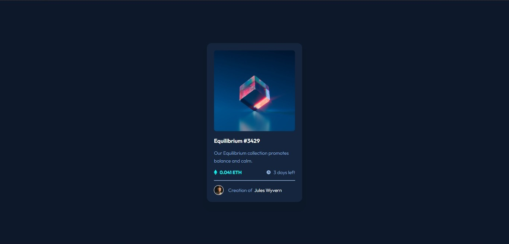
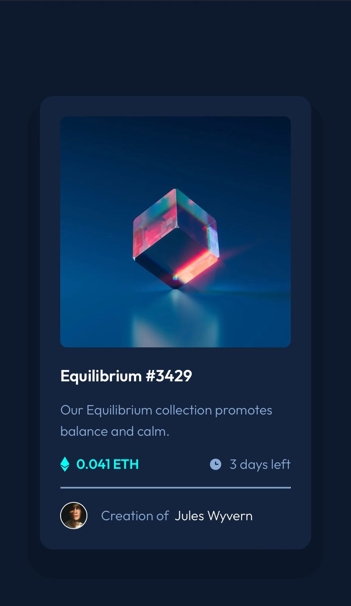
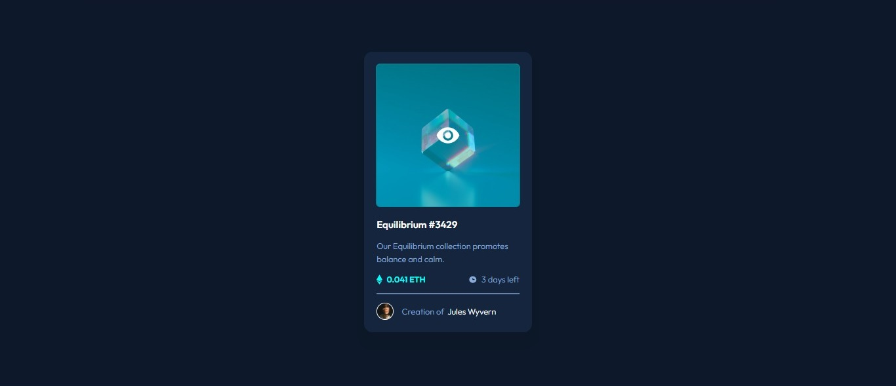

# Frontend Mentor - NFT preview card component solution

This is a solution to the [NFT preview card component challenge on Frontend Mentor](https://www.frontendmentor.io/challenges/nft-preview-card-component-SbdUL_w0U). 

## Table of contents

- [Overview](#overview)
  - [The challenge](#the-challenge)
  - [Screenshot](#screenshot)
  - [Links](#links)
- [My process](#my-process)
  - [Built with](#built-with)
  - [What I learned](#what-i-learned)
  - [Useful resources](#useful-resources)
- [Author](#author)
- [Acknowledgments](#acknowledgments)

## Overview

### The challenge

Users should be able to:

- View the optimal layout depending on their device's screen size
- See hover states for interactive elements

### Screenshot

Desktop

Mobile

Hover effect

### Links

- Solution URL: [Add solution URL here](https://github.com/rug19/NFT-preview-card-component.git)
- Live Site URL: [Add live site URL here](https://rug19.github.io/NFT-preview-card-component/)

## My process

### Built with

- Semantic HTML5 markup
- CSS custom properties
  
### What I learned

I learned to do a better HTML structure to facilitate the part of sterilization using CSS, which helps to have a better understanding of what is going on in my code. I also used effects like hover in this project that I didn't know how it uses, which was good because I had to look for information to learn something new.  

### Useful resources

- [fedmentor](https://fedmentor.dev/) - Thi is helped me a lot with my HTML structure. 
- [w3school](https://www.w3schools.com/) - This is an amazing website about programming. I'd recommend it to anyone that started to learn to program and need to research things during the process of learning. 

## Author

- Website - [Ruan Gomes](https://rug19.github.io/NFT-preview-card-component/)
- Frontend Mentor - [@rug19](https://www.frontendmentor.io/profile/rug19)

## Acknowledgments

I'd to thank the Front end mentor community for always giving support and help. 
